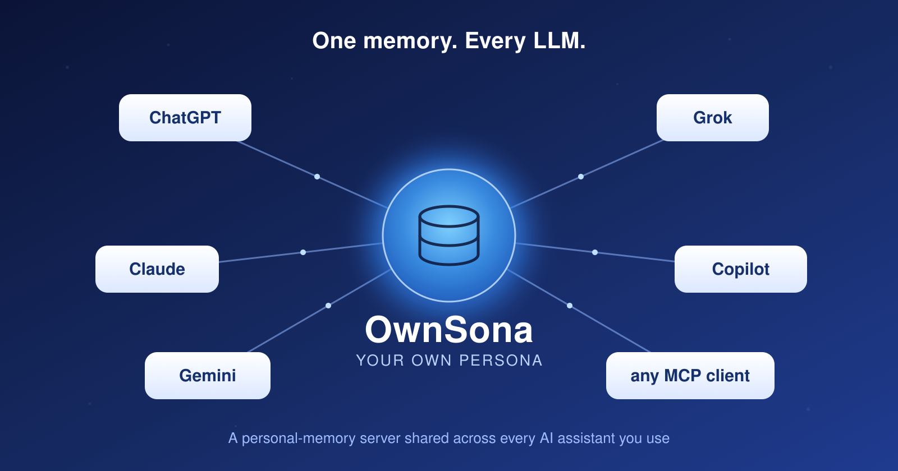

# OwnSona: One Memory, Every LLM

### By Blake McBride, with Claude Code



## The problem: your AI assistants all have amnesia — separately

If you use more than one AI assistant, you already know the chore. You
explain to ChatGPT who you are, what you do, who your family is, how you
like your answers formatted, and where your projects live. Then you open
Claude and explain it all again. Then Gemini. Then whatever model ships
next month.

And it gets worse: each assistant forgets between conversations anyway.
Close the tab, start a new chat, and you are a stranger again. Switch
providers, upgrade to a newer model, or try the hot new assistant
everyone is talking about, and your accumulated context resets to zero.

The underlying issue is that **memory is locked inside each provider's
walled garden.** ChatGPT's memory does not talk to Claude's. Claude's
does not talk to Gemini's. There is no shared, durable place where the
facts about *you* live — facts that should outlast any single product,
any single model version, any single company.

That is the problem OwnSona solves.

> **The name.** OwnSona is a contraction of **your OWN perSONA** — the
> persistent identity and context that belongs to *you*, not to any one
> AI vendor. It is your persona, under your control, that every assistant
> can read.

## How OwnSona solves it

OwnSona is a single, durable **personal-memory server**. Instead of
teaching each AI assistant about yourself over and over, you teach
*OwnSona* once, and every assistant connects to the same memory store.

The key that makes this work is the **Model Context Protocol (MCP)** —
the emerging open standard that lets AI assistants call external tools
and data sources. ChatGPT, Claude, Gemini, Grok, Copilot, and a growing
list of others all speak MCP. OwnSona is an MCP server. Point any
MCP-capable assistant at it, and that assistant can now read from and
write to your memory.

The result is a genuinely shared brain:

- Tell ChatGPT once that your dog's name is Mochi, that you prefer
  concise answers, or that you're a Go developer just learning React —
  and your **next** conversation, in Claude or Gemini, already knows.
- A fact written by one model is instantly recallable by the next.
- Your context follows you **across providers, across models, and across
  years** — independent of whose product is currently in fashion.

Under the hood, OwnSona stores each memory in **PostgreSQL** and computes
a vector **embedding** of its text (using OpenAI's
`text-embedding-3-small` model, via a swappable provider abstraction).
Those embeddings live in a `pgvector` column. When an assistant asks
"what do you know about my work?", OwnSona does a **semantic similarity
search** — it finds the memories whose *meaning* is closest to the
question, not just the ones that share keywords. The relevant facts come
back, the assistant folds them into its answer, and you never had to
repeat yourself.

A few things worth knowing about the design:

- **It is read-and-write for every client.** Assistants don't just read
  your memory — they can record new facts as you talk, so the store grows
  naturally over time.
- **It is secure by default.** Every request is authenticated with OAuth
  2.1 (the server bundles its own authorization server, so you don't need
  an external identity provider). Inputs that look like secrets — API
  keys, tokens, private-key blocks — are rejected before they can ever
  land in the database.
- **It is single-user and self-hosted.** Your memory lives on *your*
  server, not in a vendor's cloud.

## From a memory to a mind: it learns

Here is where OwnSona stops being a notes file and starts being something
more interesting. Most "AI memory" is passive: it stores what you write
and hands it back on a match. OwnSona's memory **gets better with use.**

- **It learns which facts matter.** When an assistant uses a memory to
  answer you, it can tell OwnSona whether that memory actually
  *helped* — and that feedback raises the memory's learned importance, so
  genuinely useful facts surface first next time and noise sinks. There is
  no "forgetting because it's old": nothing is ever demoted just for
  aging. Only your feedback, and explicit corrections, change a memory's
  standing.

- **It learns the *context* a fact belongs to.** Beyond a single
  importance score, each memory quietly learns *which kinds of questions*
  it tends to answer well. Ask "where do I live?" and the fact that earned
  its place answering that question before rises to the top — even over
  facts that merely share words with your query.

- **It keeps itself honest.** People change — you move, switch jobs,
  change your mind. A plain memory store just piles the new fact on top of
  the old contradictory one and serves both. OwnSona notices when a new
  fact collides with an existing one on the same topic, and lets you
  retire the wrong one or demote the merely outdated one — so the store
  reflects what's *true now*, not an archaeological pile of everything you
  ever said.

- **It tidies itself while you sleep.** A background job periodically finds
  near-duplicate memories and merges each cluster into one clean,
  canonical fact, retiring the redundant copies — the digital equivalent
  of consolidating scattered notes into a single good one.

- **It learns how your facts connect.** A background pass reads your
  memories and extracts the *relationships* in them — who manages whom,
  who is married to whom, what lives where — into a small knowledge graph.
  That lets an assistant answer **multi-hop** questions ("who is my
  manager's spouse?") by walking the connections, something a flat
  "find similar text" search simply cannot do.

The simplest of these — learning what matters and learning context — are
pure mathematics, always on, with no extra dependency. The cleverer
ones — automatic consolidation, automatic conflict resolution, and
building the knowledge graph — call on an LLM of *your* choosing,
configured separately from everything else, and run quietly in the
background rather than slowing down a live request. They ship turned off,
so you opt in when you want them. And nothing they do is destructive:
every change is reversible, and any fact you have locked (see `keep`,
below) is left strictly alone.

The honest framing: OwnSona doesn't make the *AI* smarter — the model's
reasoning is still the model's. What it does is give that reasoning a
memory that **learns from experience and keeps itself coherent**, which is
exactly the part a stateless chatbot throws away at the end of every
conversation.

## It's open source, and it's built on Kiss

OwnSona is **free and open source**, released under the permissive **BSD
2-Clause license**. The code lives on GitHub:

> **<https://github.com/blakemcbride/Ownsona>**

The server is written in Java and is built on top of the open-source
**[Kiss web development framework](https://kissweb.org)** — a full-stack
Java framework that provides the servlet plumbing, the JSON-RPC base
class that OwnSona's MCP server extends, the database connection pool,
the configuration loader, and the `bld` build system. Building on Kiss
meant the OwnSona project could focus on the memory logic rather than
reinventing the web-server scaffolding. Kiss has its own documentation,
manual, and source at [kissweb.org](https://kissweb.org).

## Setting it up (the overview)

OwnSona is designed to run on a small Linux server (the reference
deployment is a modest 2 GB Ubuntu VPS). The full, copy-paste-able
walkthrough is in the repository's `INSTALL.md`; here is the shape of it.

**1. Install the pieces.** You need three things working together:

- **PostgreSQL 16** with the `pgvector` and `pg_trgm` extensions — this
  stores the memories and their embedding vectors.
- **Apache Tomcat 11**, which runs the OwnSona web application and
  terminates HTTPS directly on port 443.
- An **OpenAI API key**, used only to turn memory text into embedding
  vectors (this is the one pay-per-use dependency, and it is swappable).

**2. Set up the database.** A one-shot script does the whole job:

```bash
sql/setup_db.sh "<a-database-password-you-choose>"
```

It creates the application role, the extensions, the `memories` table,
and all the indexes (including the vector index that makes recall fast).

**3. Configure `application.ini`.** Copy the shipped template and fill in
your secrets and endpoints — the database password, your OpenAI key, a
login username/password you invent to guard the consent screen, and the
OAuth settings:

```bash
cp src/main/backend/application.ini.example src/main/backend/application.ini
$EDITOR src/main/backend/application.ini
```

**4. Build and deploy.**

```bash
./bld -v build && ./bld war
cp work/Kiss.war /home/ownsona/tomcat/webapps/ROOT.war
```

A `systemd` unit (`ownsona.service`) supervises the server, and the
database schema upgrades itself automatically at startup, so future
updates are a simple WAR swap.

**5. Connect your assistants.** This is the part that feels like magic.
For every modern MCP client, the *only* thing you give it is the server
URL:

```
https://<your-host>/mcp
```

The first time the assistant uses it, OwnSona opens a browser tab, you
log in with the username and password you set in step 3, click
**Allow**, and you're done. From then on the assistant talks to your
memory automatically. In Claude.ai, Claude Desktop, ChatGPT, or Grok,
this is a "custom connector" / "add MCP server" field — paste the URL,
choose OAuth, and connect.

## The command-line companion

Not everything belongs in a chat window. OwnSona ships a small,
self-contained **command-line client** (under `cli/` in the repo) for
working with your memory store straight from the terminal — ideal for
scripting, bulk edits, backups, and bulk-loading facts.

It is written in portable C with a single dependency (libcurl) and builds
from one Makefile on Linux, macOS, and Windows. A taste of what it does:

```bash
ownsona add    "My dog's name is Mochi." --tags family,pets
ownsona query  "what is my dog's name"      # semantic recall
ownsona search "Subaru"                      # plain substring search
ownsona list                                 # most recent memories
ownsona reinforce 17 --query "my dog"        # feedback: this one helped
ownsona conflicts                            # surface contradictions
ownsona relations "my manager"               # walk the knowledge graph
ownsona stats                                # counts, tags, overview
ownsona dump   backup.json                   # full JSON snapshot
ownsona restore backup.json                  # re-load from a snapshot
```

It also has interactive **curation** commands (`display`, `enumerate`,
`change`, `delete`) for walking through your memories and tidying them
up, with id selectors like `5-9,12,20-$` to act on ranges at once.

The headline command is **`teach`**. Hand it a long piece of prose — an
autobiography draft, a journal, a pile of project notes — and it uses an
LLM to extract durable, third-person facts about you and bulk-load them
into your memory in one shot:

```bash
ownsona teach my-life-story.txt --subject Blake --commit
```

It's dry-run by default (so you can review what it extracted before
committing), and it's vendor-neutral by configuration — point it at
OpenAI, OpenRouter, a local Ollama server, or anything that speaks the
OpenAI chat-completions shape. This is the fastest way to go from "empty
memory" to "knows my whole life story."

The CLI authenticates with the same OAuth flow as the assistants: run
`ownsona auth login` once, and it keeps your tokens fresh from then on.

## The `keep` mechanism: protecting what matters

Here is a subtle but important problem with a shared, writable memory:
**if any assistant can edit or delete any memory, then any assistant can
also *corrupt* your most important facts** — by accident, by
"helpfully" rewriting them, or by deciding a fact looks stale.

OwnSona's answer is the **`keep` flag**. Every memory carries one of
three values:

- **`Y`** — *protected.* The memory cannot be changed or deleted by any
  client, including every connected LLM.
- **`N`** — not protected.
- **`U`** — unspecified (the default for new memories).

A `keep='Y'` memory is effectively **immutable and undeletable** through
the normal tool surface. Its text, tags, and importance are locked, and
it can't be soft-deleted or hard-deleted. Assistants can still *see* the
protection status — the flag is returned on every read — but they can
never alter it.

So how do *you* change the flag, if the assistants can't? Through the
command-line client only, and even there it's deliberately hard to do by
accident:

- The flag-changing operation (`set_keep`) is **not advertised** to LLM
  clients at all — it doesn't appear in the list of tools they can see,
  so a model can't even discover it exists.
- Changing the flag requires an **admin secret** that you configure on
  both the server and the CLI. They must match.
- It **fails closed**: if no secret is configured, *every* attempt to
  change a protection flag is rejected. There is no default-open path.

The practical effect: you can mark your bedrock facts — your name, your
family, the load-bearing details of your projects — as `keep='Y'` from
the CLI, and then connect a dozen AI assistants with confidence that none
of them can quietly mangle or forget those facts. The flag is a one-way
lock you hold the only key to (and it's reversible from the CLI, so
there's never a permanent lockout).

## In the end, it's a copy of your brain

Step back, and what OwnSona really is becomes clear: it is an
**electronic copy of the part of your brain that you'd otherwise have to
re-explain to every machine you talk to.**

The names, the relationships, the preferences, the projects, the hard-won
context that makes advice *yours* instead of generic — all of it lives in
one durable place that you own and control. You teach it once; it learns
which parts matter, keeps itself consistent, and maps how it all connects.
You protect the facts that matter with `keep`. And then every AI assistant
you use — today's and next year's, this vendor's and the next — plugs into
the same memory and instantly knows you.

Models will keep changing. Providers will keep competing. The hot
assistant of next year doesn't exist yet. But your persona — your *own*
persona — doesn't have to start over every time. With OwnSona, it
follows you.

---

*OwnSona was created by **Blake McBride**, working with
**[Claude Code](https://claude.com/claude-code)**, Anthropic's agentic
coding tool — which also helped write this article. OwnSona is open source
under the BSD 2-Clause license. Source, docs, and install guide:
<https://github.com/blakemcbride/Ownsona>. It is built on the
[Kiss web development framework](https://kissweb.org), created by Blake
McBride.*
